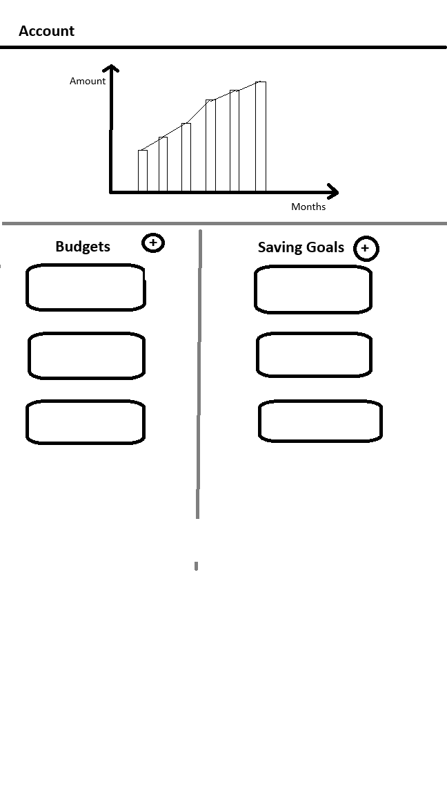

# Accounts page plan

I want to overhaul my budgets screen into a screen for users to see their total money in their account.
## Features:
### Set Budgets
- keep current budgets implementation, allowing users to add budgets for their categories
- additional functionality to add overall spending limit

### Set Saving Goals
- Allow users to set saving goals for items

Note: Savings for now are leftover money from past weeks/months
eg. 
- Monthly savings = salary - total spending in the month
- Weekly savings = (salary/ no. of weeks ) - total spending in the week